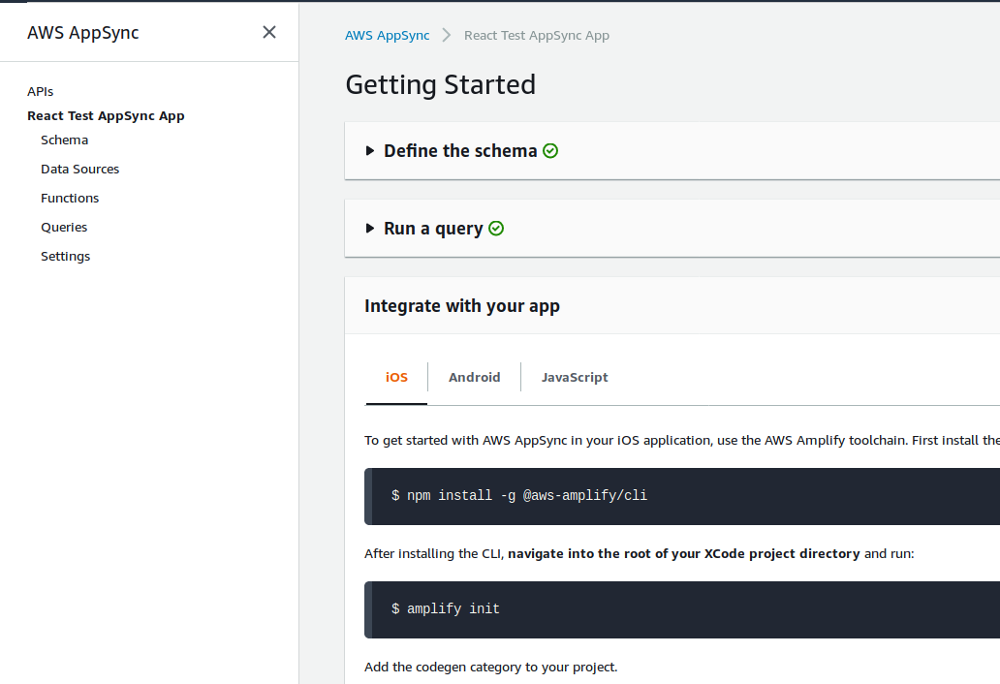

Recently I've been commissioned to find out the best way to create an API on AWS.

Which will be consumed by native mobile clients.

<!--more-->

---

The landscape is pretty simple. For a classic REST API one can go the [Amazon API Gateway](https://aws.amazon.com/api-gateway/) way. For GraphQL the [AWS AppSync](https://aws.amazon.com/appsync/) way.

At the first sight everything is easy: choose a service. After digging in all gets complicated for REST. GraphQL stays clean.

The reason?

**AppSync / GraphQL** has better automation. All supporting services (functions, data, storage, authorization) are integrated, made quasi-invisible, or configurable with a click. One has to manage a single umbrella service. That's all.

**The REST API Gateway** turns out it's just one piece of the puzzle. Unlike AppSync it is not enough to provide an API alone. It needs to be connected manually at least with AWS Lambda and DynamoDB &mdash; functions and data.

Instead of one service REST ends up with three. Three times more work? Nope. More. Since it has no code generators like GraphQL all code has to be written manually first. That results in _more work by a magnitude_.

There are third party generators, tools and frameworks to help. In fact there is an entire industry built around making REST APIs work on Amazon &mdash; it is that complicated.

While in a few days it was possible to set up AppSync with React and play thoughtfully with optimizations and experience (Relay vs. Apollo) &mdash; spending the same time with the REST API was enough only to create and manage the schema; Adding the necessary Lamdba functions and data backend was unsuccessful with generators and tools provided by the ecosystem.

## REST

To catch the glimpse of the REST on AWS complexity one should watch these two handpicked official videos. The first deals with [the difficulty to create an API](https://www.youtube.com/watch?v=xkDcBssNd1g) and the second with the difficulty of [ensuring best practices](https://www.youtube.com/watch?v=9ElpSPXk-g8).

Following the advice from the videos one should use the recommended tools to achieve better results faster:
[Swagger](https://swagger.io/), [Serverless](https://serverless.com/), [Claudia.js](https://www.claudiajs.com/) &mdash; even Amazon's own [Amplify](https://aws.amazon.com/amplify/).

My personal experience: No success. Bugs, outdated code and documentation, undocumented features, [frightening](https://serverless.com/blog/node-rest-api-with-serverless-lambda-and-dynamodb) amount of code to be written.

The conclusion I've left with is: AWS REST APIs are complicated, and expensive compared to their GraphQL / AppSync alternative.

## GraphQL

GraphQL is the successor of REST. It offers the following advantages:

#### 1. Flexible API

GraphQL needs no versioning. One of the pain points of REST APIs was to iterate over versions yet keep it transparent to API clients and end users.

GraphQL removes that and keeps the development and maintenance time smaller.

#### 2. Data-driven apps with real-time and offline capabilities

REST APIs were an artifact before the mobile era. They simply served atomic data per request. Like a list of all articles. Nothing more.

With mobile devices the requirements changed: smarter and low-bandwidth data queries (composed by need versus the usual REST CRUD operations) which even can be pushed without request (real-time) and are resilient when network services are unavailable (offline capabilities).

As an example a GraphQL app can request all data in a single query for an entire page. In case of a homepage let’s say all articles together with authors, comments and likes. This data is automatically cached locally for offline access, and when one of its part is updated (let’s say new article added) the new data is pushed to the device and visualized automatically.

## AppSync

AppSync is Amazon's GraphQL service. Manages the API schema, the queries for the schema, the data sources attached to a schema, and the functions / business logic reused across the schema / app.

The great thing, the magic of AppSync is that one has to work only on the schema and forget the rest.

After defining the schema &mdash; with a single click! &mdash; you'll get all GraphQL queries, mutations and subscriptions automatically generated. In other words you get a public, working API out of the box. An URL anyone can access and play with your API.

Next, by using the [AWS Amplify Framework](https://aws.amazon.com/amplify/) &mdash; a command line tool to create, manage and implement Amazon web services &mdash; with a few simple commands everything else can be set up again, like data, authentication, storage, hosting and even various clients to consume the API.

With AppSync and Amplify one can have a mobile-friendly API server and client in ... minutes. Once a schema is done the rest is done by AWS.

## Resources

- [The Amazon API Gateway](https://aws.amazon.com/api-gateway/)
- [AWS AppSync](https://aws.amazon.com/appsync/)
- [The AWS Amplify Framework](https://aws.amazon.com/amplify/)
- [Building a REST API in Node.js with Lambda, API Gateway, DynamoDB, and Serverless framework](https://serverless.com/blog/node-rest-api-with-serverless-lambda-and-dynamodb/)
- [Building API-Driven Microservices with Amazon API Gateway - AWS Online Tech Talks](https://www.youtube.com/watch?v=xkDcBssNd1g)
- [Best Practices for Building Enterprise Grade APIs with Amazon API Gateway - AWS Online Tech Talks](https://www.youtube.com/watch?v=9ElpSPXk-g8)
- [Swagger](https://swagger.io/)
- [Serverless](https://serverless.com/)
- [Claudia.js](https://www.claudiajs.com/)
