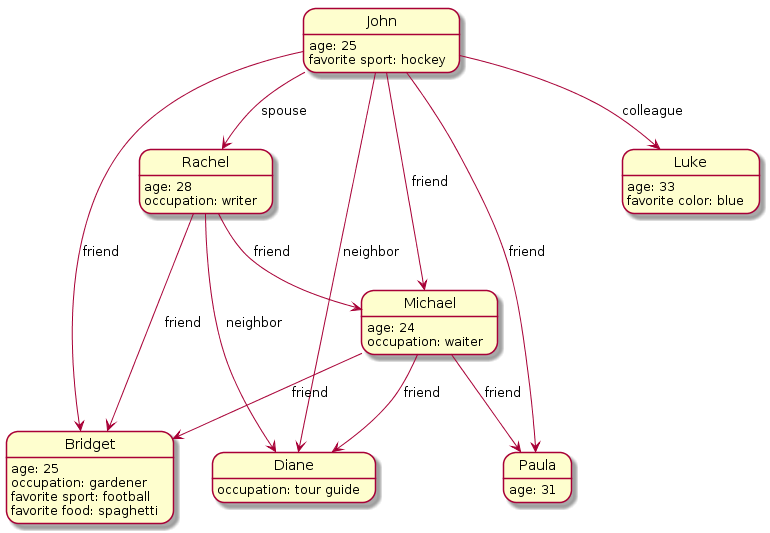
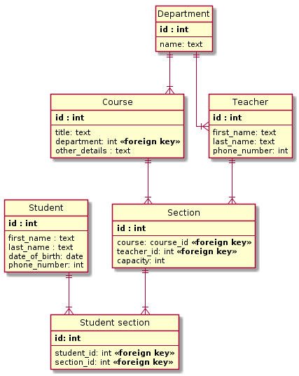

Easy to use on the front-end. More complicated to model and scale.

<!--more-->

## Definition

GraphQL, according to [GraphQL.org](https://graphql.org/learn/) is three things:

1. A query language
2. A server-side runtime
3. A type system

### Query language

We all know query languages. SQL &mdash; to query relational databases. REST API &mdash; to query data on the backend.

GraphQL is in the same way a query language. It is like REST built on the more advanced principles of [functional and reactive programming](http://metamn.io/react/is-graphql-functional-and-reactive/).

### Server-side runtime

The UNIX philosophy of

> Do one thing and do it well

[is built into](https://www.youtube.com/watch?v=gb1R-fWP1Yw) GraphQL making it a super simple layer on the server.

The GraphQL runtime does only one thing: returns results for queries. How results are computed, put together, collected from other services &mdash; the business logic &mdash; is outside of its scope.

(As a compensation) GraphQL offers extensive connectivity to various backend services like databases, storage engines, serverless functions, authentication, caching to be used in any combination to define how the application works.

### Type system

What glues together the client-side queries and server-side responses is the GraphQL Schema &mdash; a place where:

- All types are defined together with
- All fields for all types, and
- All single purpose functions (resolvers) associated with each and every field

In practice:

```js
/* A GraphQL Schema */

/**
 * Data type
 * - Defines a data entity
 */
type Book {
	id: ID
	title: String  /* A field */
	author: Author
}

/**
 * Data type
 * - Defines a data entity
 */
type Author {
	id: ID
	firstName: String  /* A field */
	lastName: String
}

/**
 * Query type
 * - Defines operations on data
 */
type Query {
	book(id: ID): Book  /* A field */
	author(id: ID): Author
}
```

```js
/**
 * Server-side, single purpose functions (resolvers)
 */
const resolvers = {
  Query: {
    author: (root, { id }) => find(authors, { id: id })
  },
  Author: {
    books: author => filter(books, { authorId: author.id })
  }
};
```

```bash
# Client-side query
#
GET /graphql?query={
	book(id: "1") {
		title,
		author
		{
			firstName
		}
	}
}
```

```js
/**
 * The result
 */
{
  "title": "Black Hole Blues",
  "author": {
    "firstName": "Janna",
  }
}
```

## The Facebook way

GraphQL was created by Facebook and later open sourced for the community. Together with the other parts of the stack &mdash; React, Relay &mdash; they [power](https://developers.facebook.com/videos/2019/building-the-new-facebookcom-with-react-graphql-and-relay/) one of the largest web apps today, Facebook.com.

It's good to be aware of the Facebook way. To learn about the best practices on large scale.

[According to Facebook](https://blog.apollographql.com/graphql-at-facebook-by-dan-schafer-38d65ef075af) GraphQL is about three things:

1. The underlying database and business model is a graph
2. There is a single source of truth
3. The API is a thin layer

### Graph databases

[Comparing Database Types: How Database Types Evolved to Meet Different Needs](https://www.prisma.io/blog/comparison-of-database-models-1iz9u29nwn37) has a great overview and definition for graph databases:

> Graph databases are most useful when working with data where the relationships or connections are highly important.

In contrast, the relational database pradigm is best used to organize well-structured data:

> In general, relational databases are often a good fit for any data that is regular, predictable.

In other words graph databases focus on interactions in an unpredictable environment while relational databases focus on structure in a well-known context.

In graph databases entities have flexible shapes and more importantly they can form relationships freely, on the fly.



In relational databases the business domain is well known apriori and what's left is to create a well performing model upon.



No wonder Facebook choose the graph approach. It handles better the use case of interaction-heavy user interfaces.

### Domain-driven design &mdash; DDD

Dynamic contexts needs [a new kind of design thinking](https://khalilstemmler.com/articles/typescript-domain-driven-design/ddd-vs-crud-design/) to be able to provide solutions.

In a rigid environment, where there are no moving parts and everything is under _control_ one could easily model _how_ things work using an _imperative_ approach.

In dynamic environments the only (relatively) sure thing is the existence of an entity. The capabilities an entity offers can change over time. Therefore the most important thing an entity can do is to _declare_ _what_ are its capabilities. Then the other parts of the system will be able to understand it and interact with.

For such evolving models where an entity is:

> An object that is not defined by its attributes, but rather by a thread of continuity and its identity.

a suitable design approach is called [Domain-driven design](https://en.wikipedia.org/wiki/Domain-driven_design).

### Microservices

The Facebook way implies Domain-driven design which is closely related to the microservices architecture.

Ville Touronen from University of Helsinki wrote a well-worth-reading [master thesis](https://helda.helsinki.fi/bitstream/handle/10138/304677/Touronen_Ville_Pro_gradu_2019.pdf) about how GraphQL connects to DDD and microservices.

In short &mdash; this new context, array of technologies, and paradigms requires the business domain to be split into different functional domains (_services_) which are highly isolated, independent and loosely coupled (_micro_).

Microservices complete the big picture. The Facebook way is a full bet on the [Functional Reactive Programming paradigm](https://blog.danlew.net/2017/07/27/an-introduction-to-functional-reactive-programming/) from design (DDD), data (GraphQL and graph databases), implementation (React) to servers (microservices).

### Single source of truth

In a dynamic context it is very important to establish a single source of truth from where all other parts of the stack approvision themselves.

The creators of GraphQL [are always eager to emphasize](https://www.youtube.com/watch?v=gb1R-fWP1Yw) the importance of such a truth layer.

In [Thinking in Graphs / Business Logic Layer](https://graphql.org/learn/thinking-in-graphs/#business-logic-layer) chapter there is a clear definition and a diagram describing the use case:

> Your business logic layer should act as the single source of truth for enforcing business domain rules


In the Facebook approach the truth gatekeeper role is given to GraphQL. 

GraphQL's type system / schema is suitable to declare and define the capabilities of an entity. And it is extendable through _Smart Data Objects / GraphQLObjectType_ to connect with the business logic layer.
```js
/**
 * From Ville Touronen's master thesis
 * 
 * See: https://helda.helsinki.fi/bitstream/handle/10138/304677/Touronen_Ville_Pro_gradu_2019.pdf
 */


/**
 * - The business logic is held in a separate layer
 * - Each type (`Book`) has an associated `model` where
 * ... data fetching, business logic, or security is solved 
 * ... exactly once for this type across the application
 * ... providing the single source of truth
 * 
 * See: https://blog.apollographql.com/graphql-at-facebook-by-dan-schafer-38d65ef075af 
 */ 
import { getBook } from './models/book'


/**
 * Bindings to the business logic layer
 */
const bookQuery = new GraphQLSchema({
	query: new GraphQLObjectType({
		name: `Query`,
		fields: {
			book: {
				type: bookType ,
				args: {
					id: {
						description: 'internal id of the book',
						type: GraphQLNonNull ( GraphQLString ) ,
					},
				},
				/**
				 * Resolvers **always** map to the business logic
				 */
				resolve: ( root, { id } ) => getBook( id ),
			}
		}
	})
});

/**
 * The capabilities of an entity aka the types
 */
const bookType = new GraphQLObjectType({
	name: 'Book',
	description: 'A book with an ISBN code',
	fields: () => ({
		id: {
			type: GraphQLNonNull(GraphQLString) ,
			description: 'The internal identifier of the book',
		},
		/* ... The other fields ... */
	})
})

/**
 * All wrapped together
 */
export const BookSchema = new GraphQLSchema({
	query: bookQuery,
	types: [ bookType ],
});
```

### Thin API Layer

xxx

## The pattern

The most important takeaway for now is the

> `type` &rarr; `field` &rarr; `resolver` &rarr; `business logic` pattern.

Types have fields and every field has an associated server-side function which returns results and connects to the business logic layer.

This pattern is a double-edged sword. It makes design and development easier but scaling on the server-side harder.

### The N+1 problem

The [N+1 selects problem](https://stackoverflow.com/questions/97197/what-is-the-n1-selects-problem-in-orm-object-relational-mapping) is a basic design and development constraint in older paradigms like relational databases. It makes the business / data / component model to follow certain strict technical guidelines which are not natural to default human thinking.

In GraphQL this issue [is automatically solved](https://www.youtube.com/watch?v=P_yfbQrdzJo&list=PLn2e1F9Rfr6kChXoURShhO3A-4r8FLYsO&index=18).

The original N+1 problem is related to database design. Improperly designed database tables can lead to more database queries than optimal reducing considerably the app response time. To circumvent this issue in the object-relational paradigm various normalization techniques are used.

In GraphQL there is no N+1 problem. One can design freely the types in the schema and a middle-layer &mdash; the Dataloader &mdash; takes care of eliminating the N+1 performance issues.

In practice this means `fields` can be freely added to `types` without worrying about normalization. Components can be modeled in a less rigid, more human friendly way using _graphs_ which let directly store the relationships between records.

Writing the associated `functions` to `fields` is again free thinking: just focus on the single purpose of the function of returning the results and forget about redundancy, caching and performance.

The chatty server-side functions (resolvers) which might repeteadly load data from the database are collected, optimized into a single request, and their results cached &mdash; by the GraphQL middle-layer.

### Challenges are mounting on the back-end

Around two third of all talks from the [2019 GraphQL conference](https://www.youtube.com/playlist?list=PLn2e1F9Rfr6kChXoURShhO3A-4r8FLYsO) is about the schema.

How to build it from fragments to make it scalable; how to design it in a way to properly handle error messages; a dozen of opinions on how to manage the growth of the schema. From Github, Facebook to Twitter, Coursera and Visa everybody is facing the schema scaling issue.

Even more [all other design patterns](https://www.youtube.com/watch?v=S22rYsesrQc&feature=youtu.be) GraphQL / DDD / Microservices are built on &mdash; API Gateway, Integration Database, Data Federation, Backend for Front End &mdash; are in the same way subjects of scaling.

ide meg valami ....

## Conclusion

GraphQL is no silver bullet. It's not better or worse than other paradigms. And no, it doesn't render the back-end developer job obsolete.

It makes app design and user interface development more human by empowering the designers and front-end developers. What is gained here has to be solved on the back-end in new ways with new efforts.

## Resources

- [Introduction to GraphQL](https://graphql.org/learn/)
- [Is GraphQL functional and reactive?](http://metamn.io/react/is-graphql-functional-and-reactive/)
- [GraphQL before GraphQL — Dan Schafer @ GraphQLConf 2019](https://www.youtube.com/watch?v=gb1R-fWP1Yw)
- [The "N+1 selects problem"](https://stackoverflow.com/questions/97197/what-is-the-n1-selects-problem-in-orm-object-relational-mapping)
- [GraphQL Execution Strategies — Andreas Marek @ GraphQL Conf 2019](https://www.youtube.com/watch?v=P_yfbQrdzJo&list=PLn2e1F9Rfr6kChXoURShhO3A-4r8FLYsO&index=18)
- [GraphQL Berlin Meetup #15: System Design and Architecture @ GraphQL — Bogdan Nedelcu](https://www.youtube.com/watch?v=S22rYsesrQc&feature=youtu.be)
- [REST-first design is Imperative, DDD is Declarative [Comparison] - DDD w/ TypeScript](https://khalilstemmler.com/articles/typescript-domain-driven-design/ddd-vs-crud-design/)
- [Microservice architecture patterns with GraphQL](https://helda.helsinki.fi/bitstream/handle/10138/304677/Touronen_Ville_Pro_gradu_2019.pdf)
- [An Introduction to Functional Reactive Programming](https://blog.danlew.net/2017/07/27/an-introduction-to-functional-reactive-programming/)
