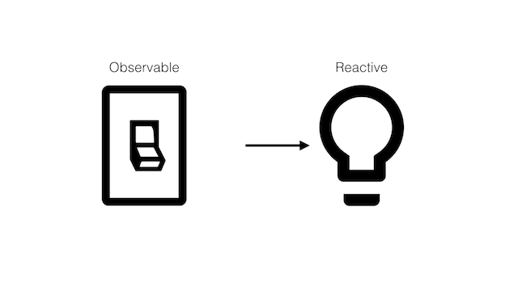

Everything in React rolls around the concept of state.

<!--more-->

A term coming from the reactive programming nature of React.

## The concept

The concept is not new. It was present and irrelevant in proactive programming. Now it is surfacing as the central element of reactive programming.

In Dan Lew's [seminal article](https://blog.danlew.net/2017/07/27/an-introduction-to-functional-reactive-programming/) about Functional Reactive Programming the concept is fully explained and put further in context. Please read it first. It's pure joy.

### Proactive programming &mdash; No state


In proactive programming a component directly modifies the state of another component &mdash; and the passive component doesn't even knows about it. In fact, the passive component has no state at all. Strictly, it has state, but it doesn't needs to know about, it is not responsible for it. State in this context really doesn't matter.

### Reactive programming &mdash; Yes! State!



In reactive programming everything is different. Each component owns its own state and modifies it on request. No component can directly modify the state of another component.

This kind of isolation brings greater composability &mdash; essential to build large systems like complex, interactive user interfaces.

### How it works

```
|============|==================|=================|==============|
| Paradigm   | Step 1           | Step 2          | Step 3       |
|============|==================|=================|==============|
| Reactive   | The switcher     | The bulb        | The bulb     |
|            | emits request    | receives        | changes its  |
|            | for state change | the request     | own state    |
|------------|------------------|-----------------|--------------|
| Imperative | The bulb         | The switcher    |              |
|            | exposes a state  | calls the state |              |
|            | change function  | change function |              |
|            |                  | of the bulb     |              |
|================================================================|
```

## State in React

State is so important in React it is marked first among its features.

> React makes it painless to create interactive UIs. Design simple views for each state in your application, and React will efficiently update and render just the right components when your data changes. &mdash; [https://reactjs.org/](https://reactjs.org/)

Even [hooks](https://reactjs.org/docs/hooks-reference.html) start with state. 

Speaking hooks React offers two of them to manage state. `useState` and `useReducer`.

None of them is powerful enough to handle complex states leaving to the ecosystem to come up with  alternatives.

- [Redux](https://redux.js.org/), [MobX](https://mobx.js.org/) &mdash; Scalable state for large applications.
- [Apollo GraphQL](https://www.apollographql.com/docs/react/essentials/local-state/) &mdash; State management bundled with data management from a proven provider.
- [XState](https://css-tricks.com/finite-state-machines-with-react/) &mdash; Finite state manachines and statecharts to manage state and make it error prone.

```
|================|=============================|===========================================
| Implementation | When to use                 | State type | Notes                       |
|================|=============================|===========================================
| useState       | Simple states               | Local      |                             |
|----------------|-----------------------------|------------|-----------------------------|
| useReducer     | Complex state logic         | Local      | With `useContext` ~= Redux  |
|----------------|-----------------------------|------------|-----------------------------|
| useMachine     | Complex state logic         | Local      | - Use for component design  |
| (XState)       | Fool-proof states           |            | - Autogenerate tests        |
|----------------|-----------------------------|------------|-----------------------------|
| Redux, MobX    | When none above are enough  | Global     |                             |
|================|=============================|============|=============================|
```

## How to choose

Every day a new state [library](https://twitter.com/DavidKPiano/status/1180174113954029570) or [approach](https://twitter.com/dai_shi/status/1178106720108679168) is popping up. There is no holy grail &mdash; everybody makes its own bet.

The general consensus *"use only when you need it"* &mdash; resonates with the basic principle of React: don't over-complicate. 

Important is to know each technique and combine by need.

## Resources

- [An Introduction to Functional Reactive Programming](https://blog.danlew.net/2017/07/27/an-introduction-to-functional-reactive-programming/)
- [React State with Hooks: useReducer, useState, useContext](https://www.robinwieruch.de/react-state-usereducer-usestate-usecontext/)
- [Application State Management with React](https://kentcdodds.com/blog/application-state-management-with-react)
- [React's useReducer vs Redux](https://www.robinwieruch.de/redux-vs-usereducer/)
- [Finite State Machines with React](https://css-tricks.com/finite-state-machines-with-react/)
- [Gatsby: Move page component state & side effect handling to xstate](https://github.com/gatsbyjs/gatsby/pull/11897)
- [Model-Based Testing in React with State Machines](https://css-tricks.com/model-based-testing-in-react-with-state-machines/)
- [Learn how to work with your local data in Apollo Client](https://www.apollographql.com/docs/react/essentials/local-state/)