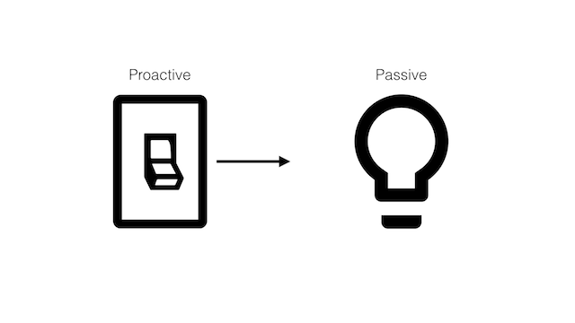

Everything in React rolls around the concept of state.

<!--more-->

A term coming from the reactive programming nature of React.

## The concept

The concept is not new. It was hidden in proactive programming and now it is surfacing as the central element of reactive programming.

In Dan Lew's [seminal article](https://blog.danlew.net/2017/07/27/an-introduction-to-functional-reactive-programming/) the concept is fully explained and put further in context. Please read it first.

### Proactive &mdash; no state



In proactive programming a component directly modifies the state of another component &mdash; and the passive component doesn't even knows about it. In fact, the passive component has no state at all. Strictly, it has state, but it doesn't needs to know about, it is not responsible for it.

### Reactive &mdash; with state


In reactive programming everything is different. Each component owns its own state and modifies it on request. No component can directly modify the state of another component.

### Summing up

```
|============|==================|=================|==============|
| Paradigm   | Step 1           | Step 2          | Step 3       |
|============|==================|=================|==============|
| Reactive   | Component #1     | Component #2    | Component #2 |
|            | emits request    | receives        | changes its  |
|            | for state change | the request     | own state    |
|------------|------------------|-----------------|--------------|
| Imperative | Component #2     | Component #1    |              |
|            | exposes a state  | calls the state |              |
|            | change function  | change function |              |
|            |                  | of Component #2 |              |
|================================================================|
```


## Resources

- [An Introduction to Functional Reactive Programming](https://blog.danlew.net/2017/07/27/an-introduction-to-functional-reactive-programming/)