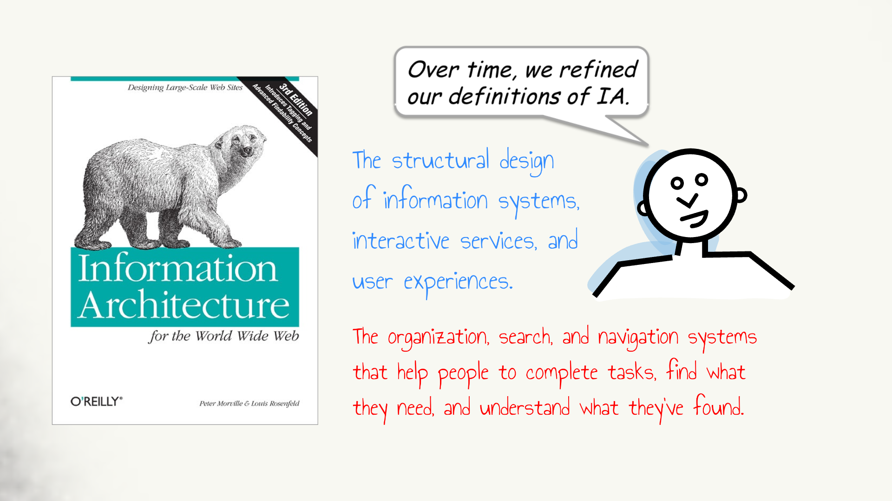

A way to think about Information Architecture close to React terms.

<!--more-->

## What is Information Architecture, and what is not?

We all think we know what Information Architecture is &mdash; so why the question?

Wikipedia has [9 definitions](https://en.wikipedia.org/wiki/Information_architecture) for this term. Chosing the ones related to web / app design and development we have:

1. The art and science of organizing and labeling web sites, intranets, online communities, and software to support findability and usability.
2. The combination of organization, labeling, search and navigation systems within websites and intranets.
3. The practice of organizing the information / content / functionality of a web site so that it presents the best user experience it can, with information and services being easily usable and findable (as applied to web design and development).

These definitions relate to keywords specific to UX design &mdash; usability, experience &mdash; yet there is a [clear differentiation](https://www.uxbooth.com/articles/the-difference-between-ia-and-ux-design/) between IA and UX:

- Information Architecture concerns structure
- User Experience concerns emotion

The problem is reduced and there is a path to follow.

## Architects of understanding

The term IA was born together with the web and evolved with mobile devices and apps.

Peter Morville, the voice of IA, [captures](https://prezi.com/aafmvya6bk7t/understanding-information-architecture/
) perfectly these moments:

... and concludes with a statement where &mdash; again &mdash; UX is removed:

Here we are in the business of understanding.

Understanding a problem and understanding how people can best solve the problem &mdash; in a interactive space. 

Modeling structure and behavior with user interfaces.

## Structure and behavior

Video: https://www.uxbooth.com/articles/complete-beginners-guide-to-information-architecture/

- Ontology
- Taxonomy
- Choreography

## React

- GQL
- FSM
- Routes + Hierarchy (https://www.uxbooth.com/articles designing-for-mobile-part-1-information-architecture/)

## Other

- https://lobste.rs/s/n4vihh/software_architecture_is_overrated
- https://eventmodeling.org/posts/what-is-event-modeling/

## Resources

- [Information architecture - Wikipedia](https://en.wikipedia.org/wiki/Information_architecture)