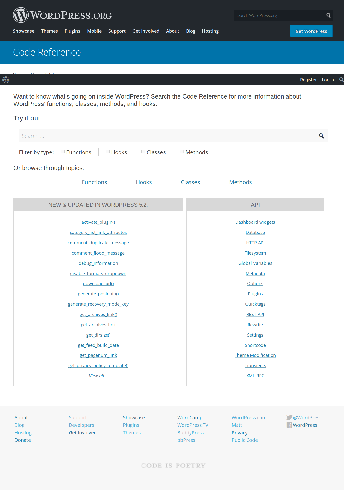

Headless as simple as possible.

<!--more-->

What if you have to update an old WordPress theme to React? And your only option is to upload a new theme in the WordPress dashboard?

No static site generation with [Gatsby](https://www.gatsbyjs.org/) and no server side rendering with [Next](https://nextjs.org/).

What left is [create-react-app](https://create-react-app.dev/) to build a Single Page Application. More exactly [create-react-wptheme](https://github.com/devloco/create-react-wptheme) which adapts `create-react-app` to WordPress.

## create-react-wptheme

The `create-react-wptheme` experience is very smooth. So smooth there is nothing to learn about. You can use the same commands to develop and deploy like when you create a regular React app. Big kudos to [@devloco](https://github.com/devloco), the unknown code artist.

## WP GraphQL

[WP GraphQL](https://www.wpgraphql.com/) and the accompanying [WP GraphiQL](https://github.com/wp-graphql/wp-graphiql) IDE are fantastic tools.

They help you to replace [WordPress template files and tags](https://developer.wordpress.org/themes/basics/template-hierarchy/) and the most part of the [WordPress API](https://developer.wordpress.org/reference/).

You won't need none of them. You won't write PHP code anymore and all theme files will be generated for you except `functions.php` in case you'll want to extend `WP GraphQL` by any chance.

The documentation for creating themes with GraphQL is in the `WP GraphiQL` plugin. Which is also serving as a live testbed to query data from the database.

It feels refreshing to read the docs next to the live code editor. It's all in one screen &mdash; without the need to fire up webpages. Not to mention I've found the GraphQL API documentation more useful than the original WordPress documentation. Better navigation, less verbose, straight to the point for a quick lookup and even deep dive.

vs.

